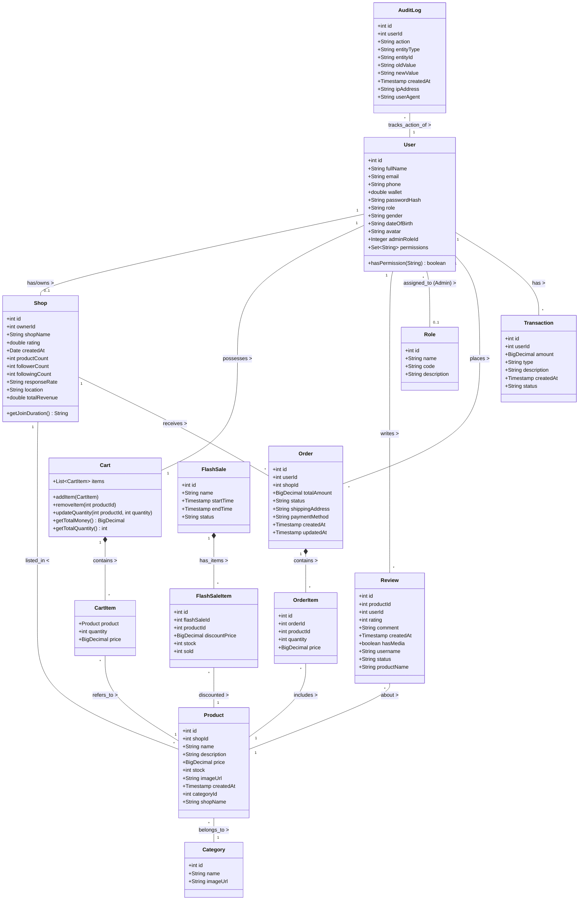

# Class Diagram: ShopeeWeb Domain Models

```mermaid
classDiagram
    %% Entities
    class User {
        +int id
        +String fullName
        +String email
        +String phone
        +double wallet
        +String passwordHash
        +String role
        +String gender
        +String dateOfBirth
        +String avatar
        +Integer adminRoleId
        +Set~String~ permissions
        +hasPermission(String) boolean
    }

    class Shop {
        +int id
        +int ownerId
        +String shopName
        +double rating
        +Date createdAt
        +int productCount
        +int followerCount
        +int followingCount
        +String responseRate
        +String location
        +double totalRevenue
        +getJoinDuration() String
    }

    class Product {
        +int id
        +int shopId
        +String name
        +String description
        +BigDecimal price
        +int stock
        +String imageUrl
        +Timestamp createdAt
        +int categoryId
        +String shopName
    }

    class Category {
        +int id
        +String name
        +String imageUrl
    }

    class Cart {
        +List~CartItem~ items
        +addItem(CartItem)
        +removeItem(int productId)
        +updateQuantity(int productId, int quantity)
        +getTotalMoney() BigDecimal
        +getTotalQuantity() int
    }

    class CartItem {
        +Product product
        +int quantity
        +BigDecimal price
    }

    class Review {
        +int id
        +int productId
        +int userId
        +int rating
        +String comment
        +Timestamp createdAt
        +boolean hasMedia
        +String username
        +String status
        +String productName
    }

    class Role {
        +int id
        +String name
        +String code
        +String description
    }

    class AuditLog {
        +int id
        +int userId
        +String action
        +String entityType
        +String entityId
        +String oldValue
        +String newValue
        +Timestamp createdAt
        +String ipAddress
        +String userAgent
    }

    class Order {
        +int id
        +int userId
        +int shopId
        +BigDecimal totalAmount
        +String status
        +String shippingAddress
        +String paymentMethod
        +Timestamp createdAt
        +Timestamp updatedAt
    }

    class OrderItem {
        +int id
        +int orderId
        +int productId
        +int quantity
        +BigDecimal price
    }

    class Transaction {
        +int id
        +int userId
        +BigDecimal amount
        +String type
        +String description
        +Timestamp createdAt
        +String status
    }

    class FlashSale {
        +int id
        +String name
        +Timestamp startTime
        +Timestamp endTime
        +String status
    }

    class FlashSaleItem {
        +int id
        +int flashSaleId
        +int productId
        +BigDecimal discountPrice
        +int stock
        +int sold
    }

    %% Relationships
    User "1" -- "0..1" Shop : has/owns >
    Shop "1" -- "*" Product : listed_in <
    Product "*" -- "1" Category : belongs_to >
    User "1" -- "1" Cart : possesses >
    Cart "1" *-- "*" CartItem : contains >
    CartItem "*" -- "1" Product : refers_to >
    User "1" -- "*" Review : writes >
    Review "*" -- "1" Product : about >
    User "*" -- "0..1" Role : assigned_to (Admin) >
    AuditLog "*" -- "1" User : tracks_action_of >
    User "1" -- "*" Order : places >
    Shop "1" -- "*" Order : receives >
    Order "1" *-- "*" OrderItem : contains >
    OrderItem "*" -- "1" Product : includes >
    User "1" -- "*" Transaction : has >
    FlashSale "1" *-- "*" FlashSaleItem : has_items >
    FlashSaleItem "*" -- "1" Product : discounted >
```
