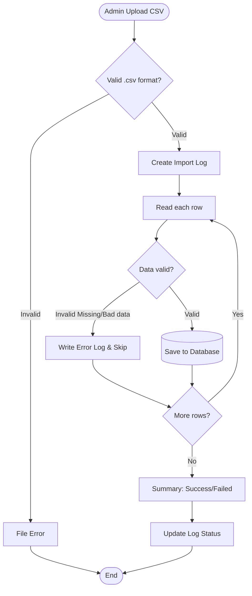

# DESIGN DOCUMENT: FLASH SALE & IMPORT MODULE

## 1. Flowchart: Flash Sale Purchase (Synchronous Processing)
Describes the processing flow when multiple users purchase simultaneously. The most important step is **Lock Stock**.

## 2. Flowchart: Import Products from CSV
Describes the product import process from CSV file with error handling.

