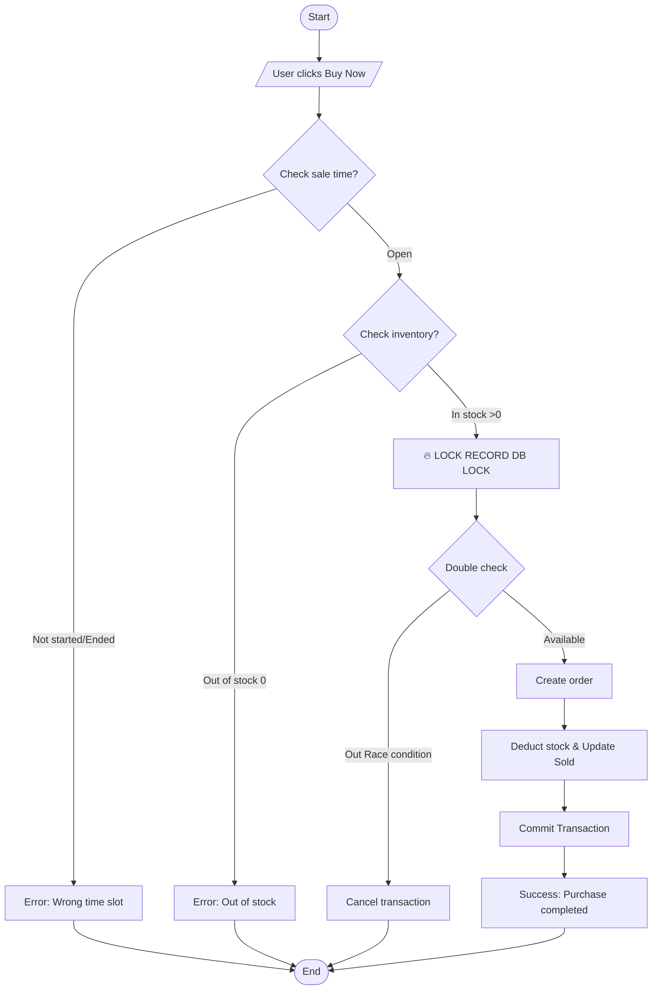
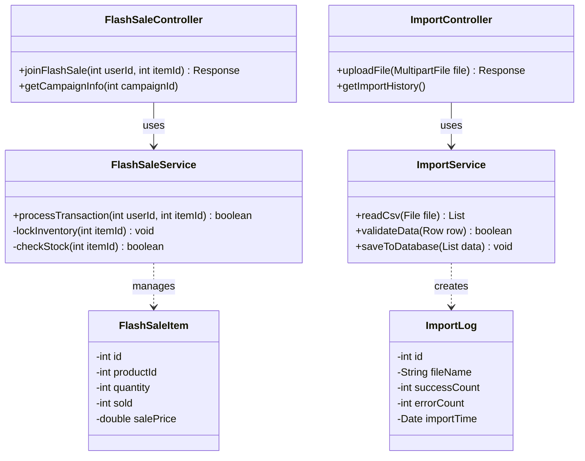

# DESIGN DOCUMENT: FLASH SALE & IMPORT MODULE

## 1. Flowchart: Flash Sale Purchase (Synchronous Processing)
Describes the processing flow when multiple users purchase simultaneously. The most important step is **Lock Stock**.

## 2. Flowchart: Import Products from CSV
Describes the product import process from CSV file with error handling.

## 3. Class Diagram: System Architecture
Shows the relationship between controllers, services, and data models.

## Key Features

### Flash Sale Module
- **Pessimistic Locking**: Prevents race conditions during high-traffic purchases
- **Double-check Mechanism**: Ensures stock accuracy before order creation
- **Transaction Management**: Guarantees data consistency with ACID properties

### Import Module
- **Batch Processing**: Handles large CSV files efficiently
- **Error Logging**: Tracks failed imports for debugging
- **Data Validation**: Ensures data integrity before database insertion

## Usage in VSCode

1. Install extension: `Markdown Preview Mermaid Support` or `Mermaid Preview`
2. View preview: Press `Ctrl+Shift+V` (Windows) or `Cmd+Shift+V` (Mac)
3. Or right-click file → **"Open Preview to the Side"**