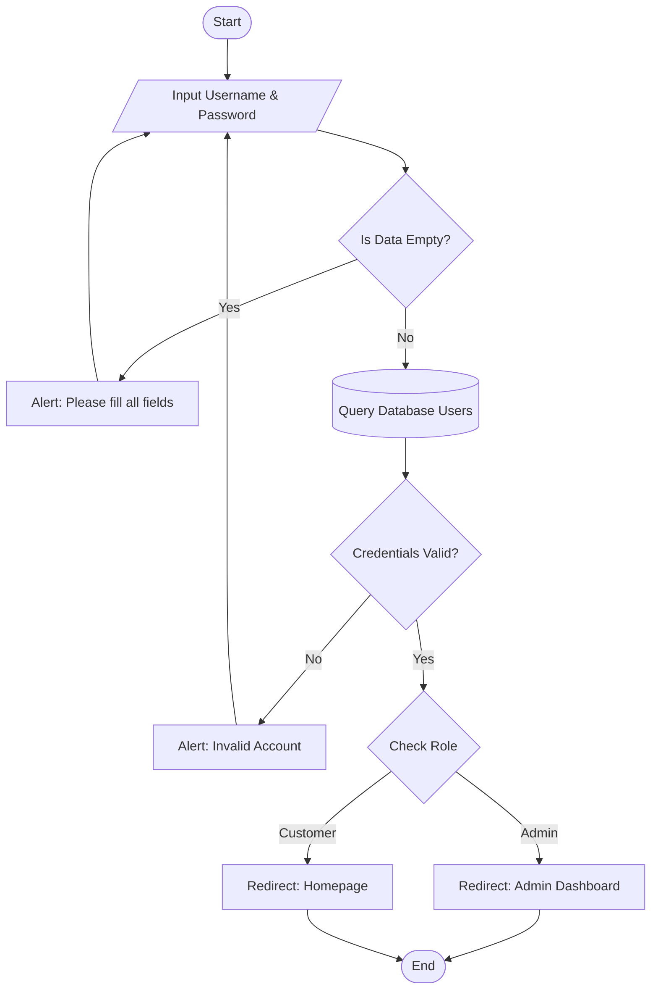
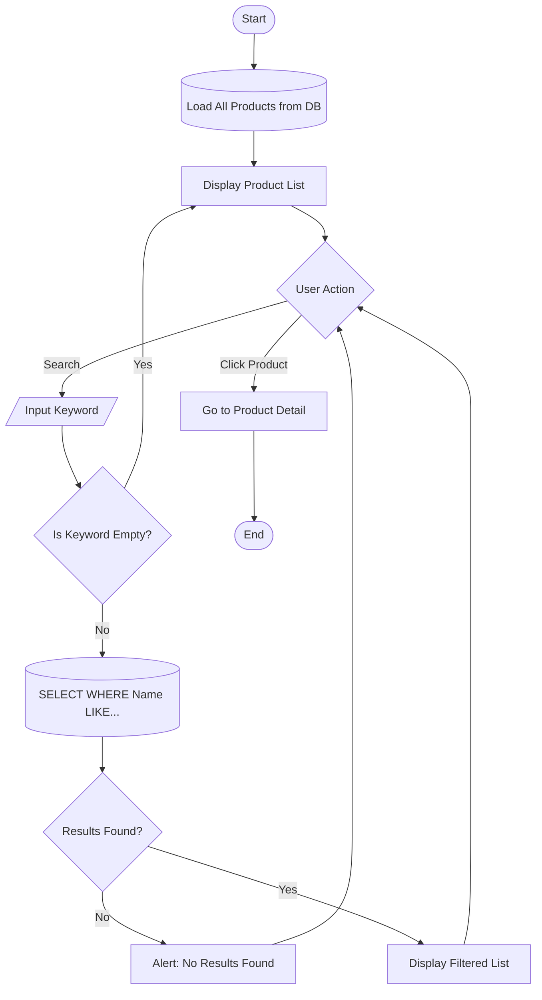
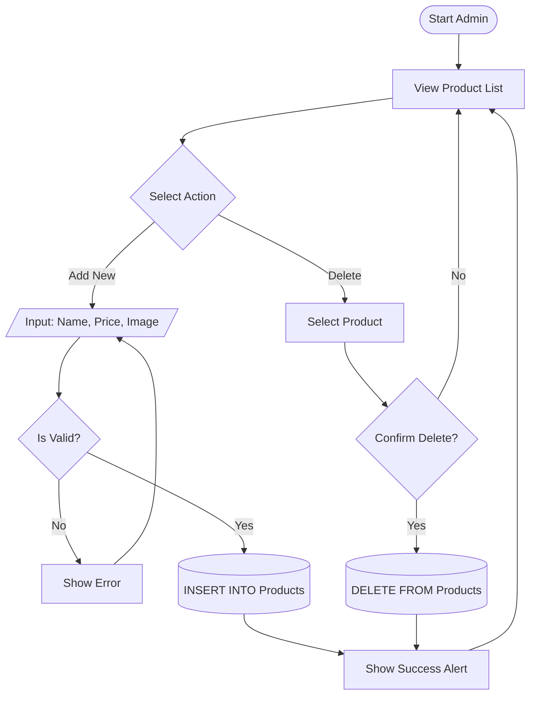
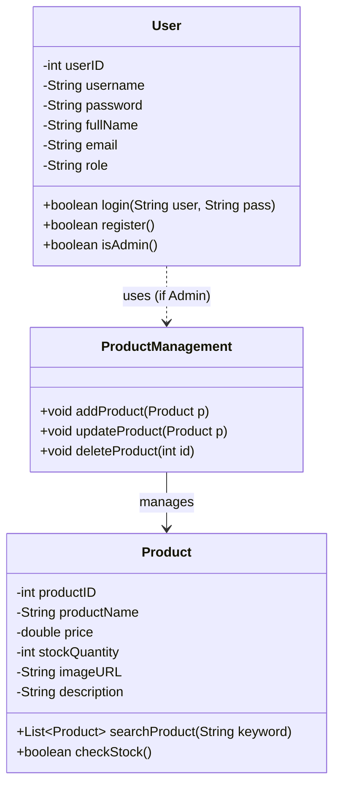

# SYSTEM FLOWCHARTS

## 1. Login Process

```mermaid
flowchart TD
    Start([Start]) --> Input[/Input Username & Password/]
    Input --> CheckEmpty{Is Data Empty?}
    CheckEmpty -- Yes --> Error1[Alert: Please fill all fields]
    Error1 --> Input
    CheckEmpty -- No --> QueryDB[(Query Database Users)]
    QueryDB --> CheckValid{Credentials Valid?}
    CheckValid -- No --> Error2[Alert: Invalid Account]
    Error2 --> Input
    CheckValid -- Yes --> CheckRole{Check Role}
    CheckRole -- Admin --> RedirectAdmin[Redirect: Admin Dashboard]
    CheckRole -- Customer --> RedirectHome[Redirect: Homepage]
    RedirectAdmin --> End([End])
    RedirectHome --> End
```

## 2. Search Process

```mermaid
flowchart TD
    Start([Start]) --> LoadAll[(Load All Products from DB)]
    LoadAll --> DisplayAll[Display Product List]
    DisplayAll --> UserAction{User Action}
    UserAction -- Search --> InputSearch[/Input Keyword/]
    InputSearch --> CheckNull{Is Keyword Empty?}
    CheckNull -- Yes --> DisplayAll
    CheckNull -- No --> QuerySearch[(SELECT WHERE Name LIKE...)]
    QuerySearch --> CheckResult{Results Found?}
    CheckResult -- No --> MsgEmpty[Alert: No Results Found]
    CheckResult -- Yes --> DisplayFilter[Display Filtered List]
    MsgEmpty --> UserAction
    DisplayFilter --> UserAction
    UserAction -- Click Product --> ViewDetail[Go to Product Detail]
    ViewDetail --> End([End])
```

## 3. Admin Process

```mermaid
flowchart TD
    Start([Start Admin]) --> ViewList[View Product List]
    ViewList --> Action{Select Action}
    Action -- Add New --> InputInfo[/Input: Name, Price, Image/]
    InputInfo --> Validate{Is Valid?}
    Validate -- No --> ErrorMsg[Show Error] --> InputInfo
    Validate -- Yes --> InsertDB[(INSERT INTO Products)]
    InsertDB --> Success[Show Success Alert]
    Action -- Delete --> SelectItem[Select Product]
    SelectItem --> Confirm{Confirm Delete?}
    Confirm -- No --> ViewList
    Confirm -- Yes --> DeleteDB[(DELETE FROM Products)]
    DeleteDB --> Success
    Success --> ViewList
```

# 4. Class Diagram (System Structure)

```mermaid
classDiagram
    class User {
        -int userID
        -String username
        -String password
        -String fullName
        -String email
        -String role
        +boolean login(String user, String pass)
        +boolean register()
        +boolean isAdmin()
    }

    class Product {
        -int productID
        -String productName
        -double price
        -int stockQuantity
        -String imageURL
        -String description
        +List~Product~ searchProduct(String keyword)
        +boolean checkStock()
    }

    class ProductManagement {
        +void addProduct(Product p)
        +void updateProduct(Product p)
        +void deleteProduct(int id)
    }

    %% Relationships
    User ..> ProductManagement : uses (if Admin)
    ProductManagement --> Product : manages
```

