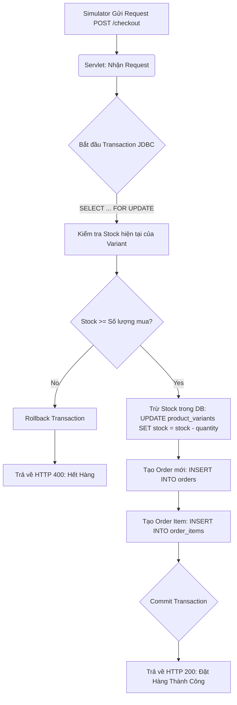
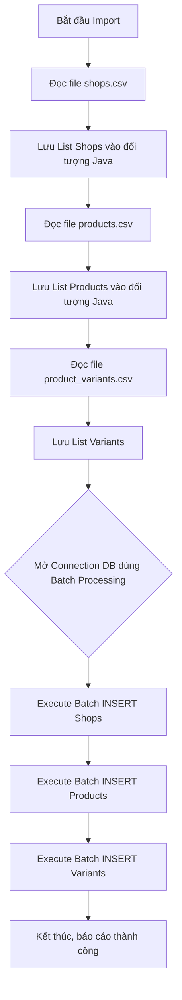

# Business Flowcharts (Lược đồ thuật toán)

## 1. Checkout & Giảm Kho (Flash Sale Simulation)

Đây là thuật toán quan trọng nhất để xử lý xung đột trong Database khi Simulator gửi hàng nghìn request cùng lúc (Stress Test).

## 2. Luồng Migration (ETL - Import Data)

